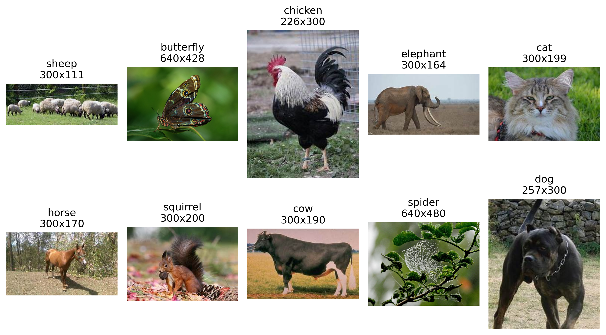

# Image Recognition Pipeline

A comprehensive machine learning pipeline for image recognition using transfer learning with ResNet50 on the Animals-10 dataset.



## Features

- **Data Curation**: Automated download, analysis, and cleaning of the Animals-10 dataset
- **Outlier Detection**: Advanced embedding-based outlier detection using ResNet50, PCA, and UMAP
- **WebDataset Creation**: Efficient data storage and loading using WebDataset format
- **Hyperparameter Tuning**: Robust optimization with Optuna and MLflow tracking
- **Model Training**: Transfer learning with ResNet50 and PyTorch
- **Visualization**: Comprehensive visualization of dataset stats and model performance

## Requirements

The project is optimized for systems with:
- CUDA-capable GPU (tested with RTX3070 with 8GB VRAM)
- Python 3.8+
- PyTorch 1.9+

Install dependencies with:
```bash
pip install -r requirements.txt
```

## Dataset

The project uses the [Animals-10 dataset from Kaggle](https://www.kaggle.com/datasets/alessiocorrado99/animals10), containing approximately 27,000 images across 10 animal classes:
- dog
- spider
- chicken
- horse
- butterfly
- cow
- squirrel
- sheep
- cat
- elephant

## Usage

### Option 1: Jupyter Notebook

Run the entire pipeline step-by-step through the Jupyter notebook:

```bash
jupyter notebook main.ipynb
```

This allows you to visualize results at each stage and make decisions on parameters.

### Option 2: Command Line (Recommended for Hyperparameter Tuning)

For better performance during hyperparameter tuning, run:

```bash
python run_hyperopt.py
```

This executes the optimization on its own, saving results to a SQLite database.

### Visualizing Results

To view the MLflow tracking UI with experiment results:

```bash
mlflow ui
```

For the Optuna dashboard to analyze hyperparameter optimization:

```bash
optuna-dashboard sqlite:///optuna_animals10_kfold.db
```

## Pipeline Structure

1. **Data Download & Preparation**:
   - Downloads Animals-10 dataset from Kaggle
   - Translates Italian class names to English

2. **Data Analysis & Cleaning**:
   - Generates comprehensive dataset statistics (class distribution, image sizes, etc.)
   - Removes problematic images (grayscale, RGBA, small resolution, duplicates)

3. **Outlier Detection**:
   - Extracts features using a pretrained ResNet50
   - Applies dimensionality reduction (PCA + UMAP)
   - Identifies both class-specific and global outliers
   - Provides visualizations of embedding space and outlier samples

4. **WebDataset Creation**:
   - Processes images (center crop, resize to 224×224)
   - Creates balanced train/test splits
   - Packages into efficient WebDataset shards

5. **Hyperparameter Optimization**:
   - K-fold cross-validation with Optuna
   - Aggressive pruning strategies
   - MLflow tracking of all trials
   - Robust statistical evaluation of hyperparameter importance

6. **Final Model Training**:
   - Trains model with best hyperparameters
   - Evaluates on test set
   - Generates confusion matrix and sample predictions

## Project Structure

```
image-recognition-pipeline/
├── main.ipynb                # Main Jupyter notebook with full pipeline
├── run_hyperopt.py           # Script for running hyperparameter optimization
├── config.py                 # Configuration settings
├── functions/                # Modular function libraries
│   ├── data_curation.py      # Dataset analysis and preparation
│   ├── dataload.py           # Data loading utilities
│   ├── final.py              # Final model training and visualization
│   ├── hyperopt.py           # Hyperparameter optimization
│   ├── model.py              # Model architecture
│   ├── train.py              # Training routines
│   └── utility.py            # Miscellaneous utility functions
├── data/                     # Data storage (created during execution)
└── requirements.txt          # Project dependencies
```

## Results

The final model achieves +95% accuracy on the Animals-10 test set using an optimized ResNet50 architecture with transfer learning.

## License

MIT License

## Acknowledgments

- The Animals-10 dataset by Alessio Corrado
- PyTorch, Optuna, MLflow, WebDataset, and UMAP libraries
